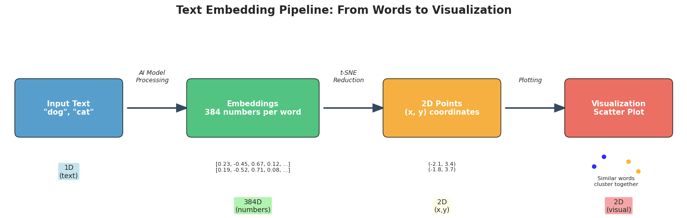

# Workshop AI for Justice, June 2025
Code and demos for the Workshop AI for Justice, 11-12 of June 2025

## Practice part 1: Retrieval Augmented Generation and chatbots

### Goal: 
Participants a divided in 2 groups (participants may choose which group they want to join)
Group 1: Advanced use of chatbots (prompting, deep research,...)
Group 2: (participants with programming experience) build a prototype RAG system to archive data, understand how it works and the limits. Reflect on the limitations.

## Practice part 2: AI for video, images and audio

### Goal: 
Get to know AI models to extract information from video, audio and images.

#### Open-Source AI Model Demos

This repository provides quick access to Google Colab notebooks for experimenting with open-source models, including speech-to-text, image understanding, and video summarization.

### 🔍 Notebooks

- **[Practice with Hugging Face models](https://colab.research.google.com/drive/1CGUX8z2O9hGMlceb3vYWVB24BymqOODV?usp=sharing)**  
  Explore and interact with various open-source models from [HuggingFace.co](https://huggingface.co).

- **[WHISPER – Speech to Text](https://colab.research.google.com/drive/1y5tyyVZSrvFKHtwbtsK7EmoMnOyeT504?usp=sharing)**  
  Convert spoken audio into accurate transcriptions using OpenAI's Whisper model.

- **[CLIP / BLIP – Image to Text](https://colab.research.google.com/drive/17jXQIl5dWUmFVJ7nn4VWDXfQi2yVevch?usp=sharing)**  
  Generate captions and understand visual content using vision-language models.

- **[Video Summarization](https://colab.research.google.com/drive/1kMyJmg1yNUvrsij4mgegwlKJlAiWl7vs?usp=sharing)**  
  Automatically extract summaries from videos.

- **[Feature Extraction from Files](https://colab.research.google.com/drive/1cpiw_KVQMLbI9dxqEispR_Vug2mwvt9T?usp=sharing)**  
  Extract feature vectors from `.zip`, audio, image, text, or video files.

---

Each notebook runs in [Google Colab](https://colab.research.google.com/) and supports interactive uploads, inference, and file processing. No local setup required.

## Practice part 3: Understanding the AI representation of data

### Goal: 
Deeper exploration of AI tools seen in Practice 2.  Experiments with Google [NotebookLM](https://notebooklm.google.com/). Understanding how AI models see similarities in the data, opening the “brain” of an AI model.

### Resources: 
The notebook `simplified_embeddings.ipynb` show how text information is structured in the "AI brain". It can be run online by clicking on "Open in Colab" . 
An [Interactive visualization](https://projector.tensorflow.org/) to see the representation of words of an AI model.

## Practice part 4: Further developing AI for archiving: 

### Goal: 
Open session for the participants' projects, combining the AI see in part 1,2 and 3.                  
Participants work on real-world archive data in teams (or their own data), developing further an archiving system or some data analysis. The teaching team assists the teams in their projects.
